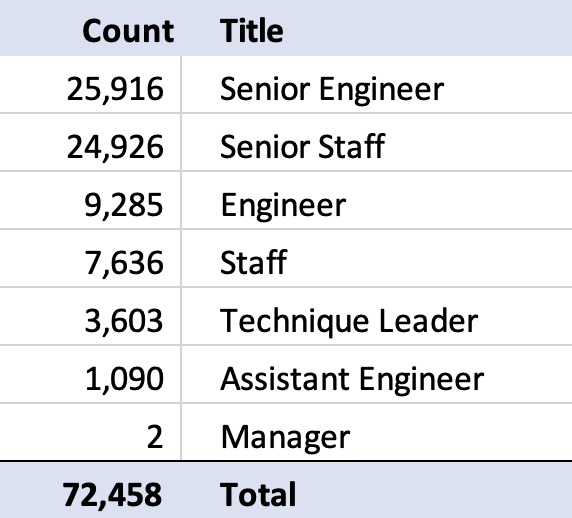
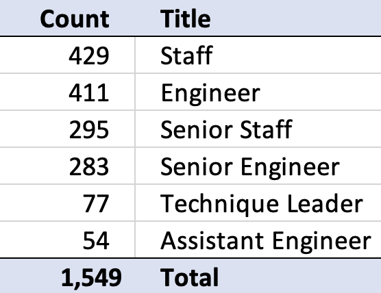

# Pewlett-Hackard Employee Database Analysis

## Overview

### Purpose

The purpose of this analysis is to help Bobby, a promising HR analyst, determine the number of retiring employees per job title, and identify employees who are eligible to participate in a mentorship program at Pewlett-Hackard.

Pewlett-Hackard is a large company that employs thousands of people, many of which are preparing to retire. An exploratory analysis on employee data was completed using PostgreSQL to generate data tables to showcase to management.

This employee database analysis can be used to inform discussion and assist management for the “silver tsunami” as many current employees reach retirement age.

## Results

### Datasets and Files

The employee database analysis is based on the following data tables: 

* Retirement Titles: [retirement_titles](Data/retirement_titles.csv)
* Unique Titles: [unique_titles](Data/unique_titles.csv)
* Retiring Titles: [retiring_titles](Data/retiring_titles.csv)
* Mentorship Eligibility: [mentorship_eligibility](Data/mentorship_eligibility.csv)

The written PostgreSQL queries for the employee database analysis is available here: [Employee_Database_challenge](Queries/Employee_Database_challenge.sql)

### Software

The software and web-based GUI (graphical user interface) tool used for this analysis are:

* Visual Studio Code Version 1.62.3
* PostgreSQL (PgAdmin 4) Version 6.1

### Outcomes 

Below are 4 points worth noting from the employee database analysis:

* An initial data exploration on Pewlett-Hackard’s employee dataset was done to filter all the employees who were born between January 1, 1952 and December 31, 1955; whom are considered employees of retirement-age. As data was retrieved, it was found that the total count of retirement-age employees is 133, 776, which is stored in the **Retirement Titles** table. This number is quite high as it includes employees that had multiple job titles throughout the years as well as employees that no longer work at the company.

* To exclude those employees that may have had multiple titles due to promotions, the **DISTINCT ON** statement was used to consider the most recent job title for each employee. In addition, the **to_date** statement was used to remove the employees that have already left the company and keep only those employees with a "to date” that is equal to '9999-01-01'. This filtered data is stored in the **Unique Titles** table, which has a total of 72,458 current, retirement-age employees with their most recent job title.

To create the **Unique Titles** table, the PostgreSQL query is as follows:

```
SELECT DISTINCT ON  (emp_no) emp_no,
                    first_name,
                    last_name,
                    title
INTO unique_titles
FROM retirement_titles
WHERE to_date = ('9999-01-01')
ORDER BY emp_no, to_date DESC;
```

* To display the 72,458 employees that are ready to retire by job title, a **Retiring Titles** table was created. This table is grouped by job title and the count is in a descending order, meaning the job titles with the highest number of counts are listed first. As noted in the table below, Senior Engineers and Senior Staff have the highest number of job positions that are soon to be available at 25,916 and 24,926, respectively.

Note: Two different table formats are provided to show the row of total counts.

<p float="left">
  
   
</p>

* Lastly, a separate data exploration was completed to identify those employees who are eligible to participate in a mentorship program at Pewlett-Hackard. Therefore, the **Mentorship Eligibility** table was created. The total number of employees qualified for this program is 1,549. The criteria used for this search was based on current employees who were born between January 1, 1965 and December 31, 1965. These employees hold at least 10 years of experience within the company making them highly qualified for the program and giving them the opportunity to share their skill sets to newer or less experienced employees in order to advance their careers.

To create the **Mentorship Eligibility** table, the PostgreSQL query is as follows:

```
SELECT  emp_no,
        first_name,
        last_name,
        birth_date
FROM employees;

SELECT  from_date,
        to_date
FROM dept_emp;

SELECT title
FROM titles;

SELECT DISTINCT ON  (emp.emp_no) emp.emp_no,
                    emp.first_name,
                    emp.last_name,
                    emp.birth_date,
                    de.from_date,
                    de.to_date,
                    titles.title
INTO mentorship_eligibility
FROM employees as emp
LEFT JOIN dept_emp as de 
ON (emp.emp_no = de.emp_no)
LEFT JOIN titles
ON (emp.emp_no = titles.emp_no)
WHERE (de.to_date = ('9999-01-01'))
AND (emp.birth_date BETWEEN '1965-01-01' AND '1965-12-31')
ORDER BY emp_no;
```

## Summary

1.	How many roles will need to be filled as the "silver tsunami" begins to make an impact? 

Based on the **Retiring Titles** table, the total number of employees soon to retire are 72,458. Looking closer at the data, the highest count of job positions to retire are Senior Engineers at 25,916 or 36% and Senior Staff at 24,926 or 34% out of the 72,458 employees.

Note: Two different table formats are provided to show the row of total counts.

<p float="left">
  
   
</p>

Furthermore, to view it from a salary perspective, a table was created to display the sum of salaries per job title for those 72,458 employees that are retiring soon. Clearly the cost to replace 25,916 Senior Engineers and 24,926 Senior Staff is quite high at an annual total of $1,255,837,996 and $1,454,372,739, respectively. 

* The data table is available here: [totalemp_titles_salaries](Data/totalemp_titles_salaries.csv)

Note: Two different table formats are provided to show the row of total counts.

<p float="left">
  
   
</p>


An additional table was created to display the total number of 240,124 employees currently working at Pewlett-Hackard. These numbers have been grouped by job title to have a relative view to the retiring titles table. This table shows the amount of opportunity to promote within the company, i.e. Assistant Engineers to Engineers to Sr. Engineer roles. Some of the benefits of doing so are increased company morale via upward mobility, retention rate improvement which saves hiring costs especially for senior roles, and opportunity to mentor entry-level employees, which leads us to the next question.

* The data table is available here: [totalemp_titles](Data/totalemp_titles.csv)

Note: Two different table formats are provided to show the row of total counts.

<p float="left">
  
   
</p>


2.	Are there enough qualified, retirement-ready employees in the departments to mentor the next generation of Pewlett Hackard employees?

There is a total of 1,549 employees ready to mentor as determined from the **Mentorship Eligibility** table. However, the ratio per department is very different to the needs the company has at the time of this analysis. For example, the number of Senior Staff and Senior Engineers available to mentor are 429 and 411, respectively, which clearly is not enough to meet the high demand that is coming from each respective job title. 

To show this data, an additional table was created using the same information as in the **Mentorship Eligibilit** table, while grouped by job title. 

* The data table is available here: [mentorship_groupeligibility](Data/mentorship_groupeligibility.csv)

Note: Two different table formats are provided to show the row of total counts.

<p float="left">
  
   
</p>


In summary, an exploratory analysis on Pewlett-Hackard’s employee data was completed using PostgreSQL to determine the number of retiring employees per job title and identify employees who are eligible to participate in a mentorship program. This analysis can be used to inform discussion and assist management and the HR department to plan for the “silver tsunami” as many current employees reach retirement age.
